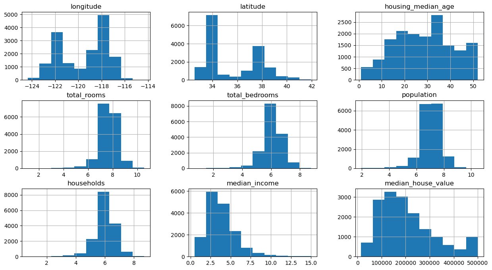
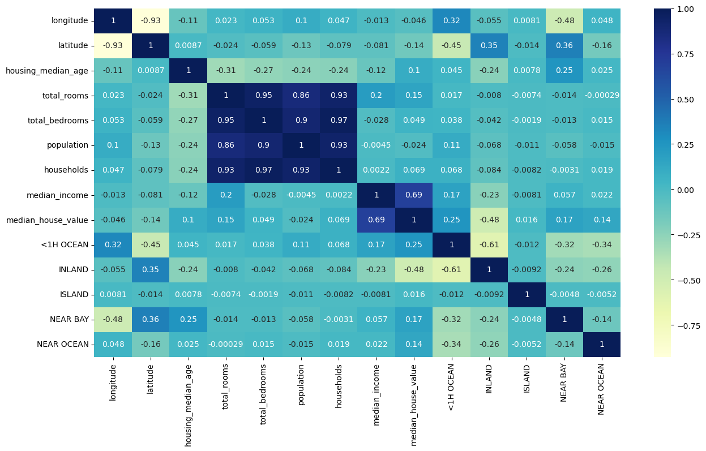
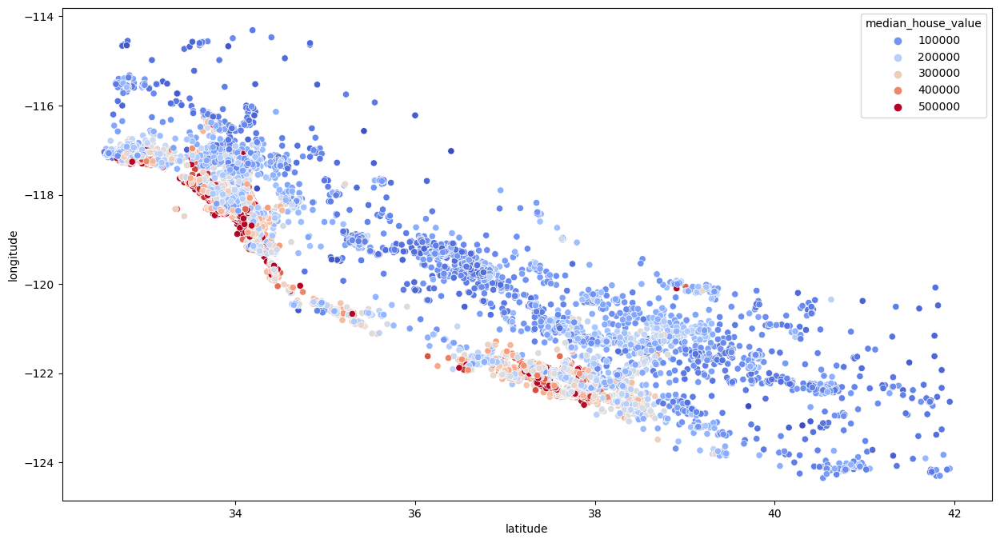

# California Housing Data Analysis

## Overview
This project involves the analysis of California housing data to uncover insights and trends in the housing market. The analysis was conducted using a Jupyter Notebook and leverages various Python libraries for data manipulation, visualization, and statistical analysis.

## Project Objectives
- Load and clean the California housing dataset.
- Perform exploratory data analysis (EDA) to identify key trends and patterns.
- Visualize the data using different types of plots and graphs.
- Utilize statistical methods to interpret the data.

## Features
- Data Loading: Importing the dataset using pandas.
- Data Cleaning: Handling missing values, and ensuring data consistency.
- Exploratory Data Analysis: Generating summary statistics and visualizing data distributions.
- Data Visualization: Creating various plots using matplotlib and seaborn to illustrate findings.
- Statistical Analysis: Applying statistical methods to draw conclusions from the data.

## Skills Utilized
- **Python Programming**: Writing efficient and clean code to manipulate and analyze data.
- **Data Manipulation**: Using pandas for data loading, cleaning, and manipulation.
- **Data Visualization**: Leveraging matplotlib and seaborn for creating insightful visualizations.
- **Statistical Analysis**: Applying statistical techniques to interpret data trends and patterns.
- **Problem-Solving**: Tackling data-related challenges and deriving meaningful insights from the data.

## Libraries Used
- **pandas**: For data manipulation and analysis.
- **numpy**: For numerical operations.
- **matplotlib**: For creating static, animated, and interactive visualizations.
- **seaborn**: For making statistical graphics.

## Sample Visualizations
Here are some sample visualizations created during the analysis:

### Distribution Among Variables


### Heatmap Showing Variable Correlation 


### Geographical Distribution of Median House Values


## How to Use
1. Clone the repository:
   ```bash
   git clone https://github.com/yourusername/california-housing-analysis.git
